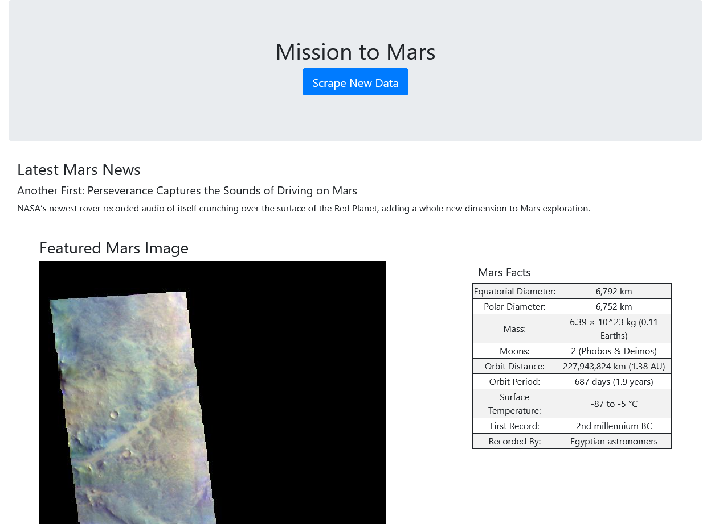
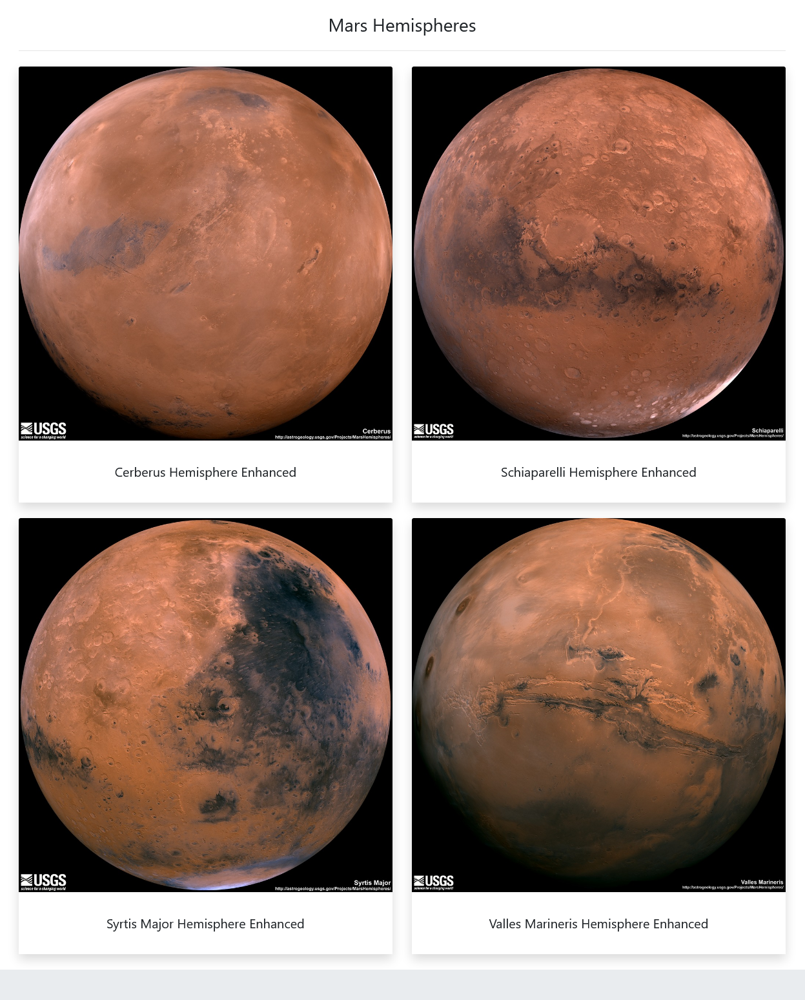

# Web-Scraping-challenge
Project to build a web application that scrapes various websites for data related to the Mission to Mars and displays the information in a single HTML page.

The project utilizes Flask, BeautifulSoup, Pandas, and MongoDB to complete the challenge.

The project scrapes data and images from the following websites:
* NASA Mars News (https://mars.nasa.gov/news/)
  - Scrape The latest News Title and Paragraph Text

* JPL Mars Space Images - Featured Image (https://www.jpl.nasa.gov/images?search=&category=Mars)
  - Scrape the latest Mars related image

* Mars Facts (https://space-facts.com/mars/)
  - Scrape the table containing facts about the planet including Diameter, Mass, etc.

* Mars Hemispheres (https://astrogeology.usgs.gov/search/results?q=hemisphere+enhanced&k1=target&v1=Mars)
  - Scrape high resolution images for each of Mar's hemispheres

Initial scraping has been done in Jupyter Notebook by using Splinter, BeautifulSoup, and Pandas.
Then the code has been converted to Python script with a function that executes all the scraping code and return one Python dictionary containing all scraped data. 
To call scrape function, Flask app was created.
The scraped data has been stored in Mongo database and retrieved to a single HTML page by jinja templating to display all information in the appropriate HTML elements. 
The HTML template was structured by using Bootstrap.  
***

